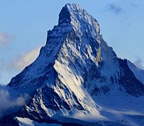
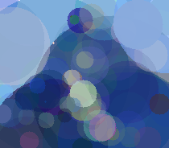
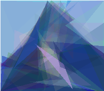
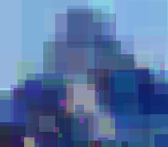
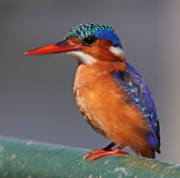
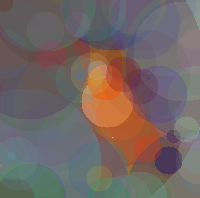
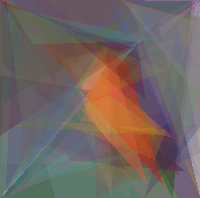
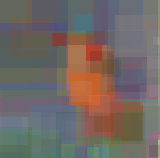

# Genetic image approximation

Using a genetic algorithm, approximate an image using simple single colour shapes such as circles, triangles and squares.

The genetic algorithm will create a population of random images, and compare how they fare compared to the reference image. The fitness function correspond to how a generated image is close to the original reference image. The fitness function used in this project is a mean squared error on all RGB components of each pixels.

The fittest images will be selected for the next generation, they will be copied and each copy will have a mutation, a small random guassian change. The possible mutations are:
- new shape added
- shape removed
- shape position and size modified
- shape colour modified

The mutated images will be compared to the reference image and if their fitness is greater than their "parent", they will be selected for the next generation.

As such, the image will slowly converge to an "acceptable" solution which will ressemble the original image.

## Examples:

   

   

## How to run

Python3 as well as the following modules are needed: `python3-tk python3-numpy python3-skimage`

Then run: `python3 genetic_images.py <filename>`

The file parameters.py contains the parameters to change the shapes and configurations for the algorithm.
